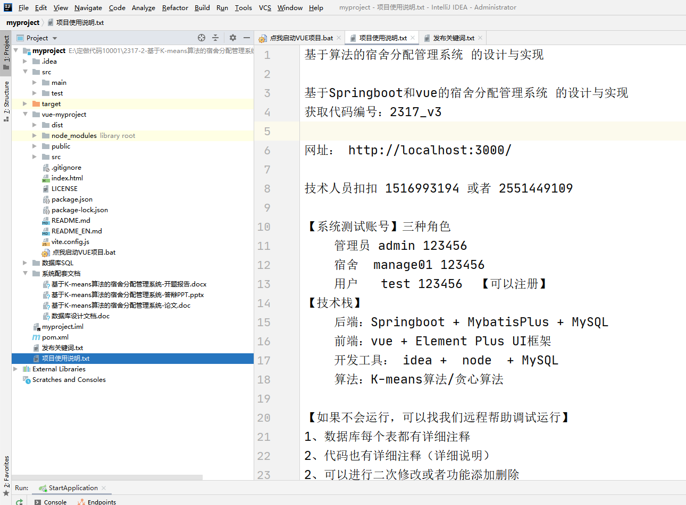
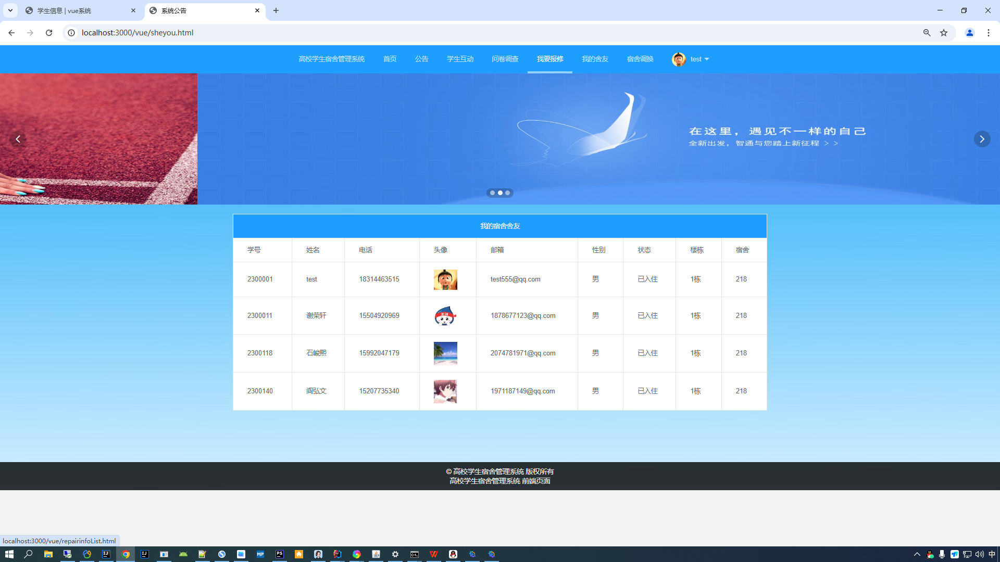
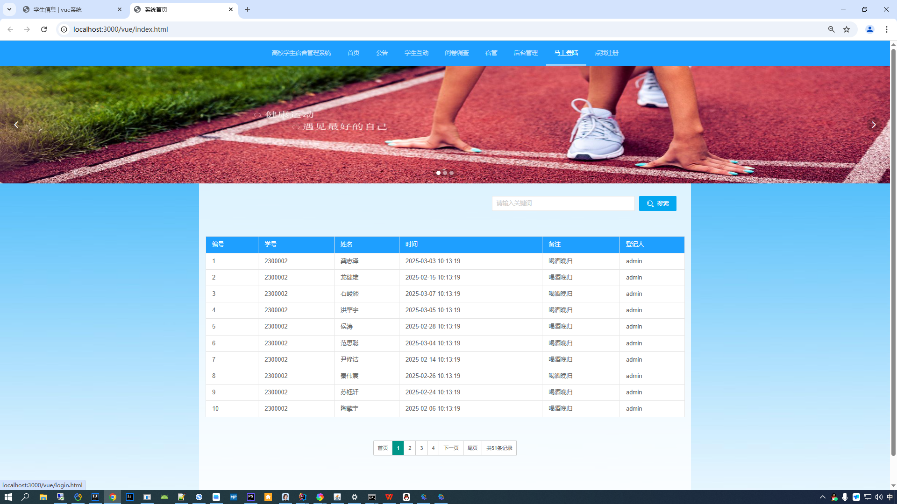
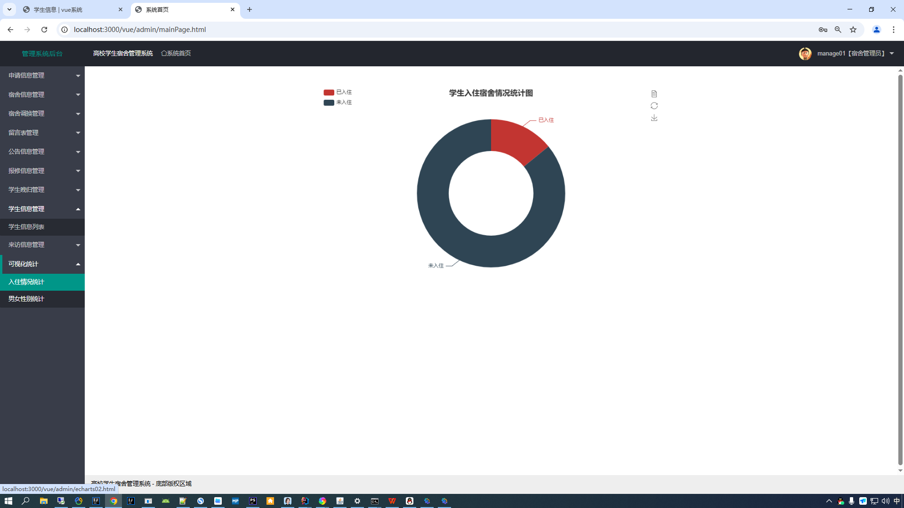
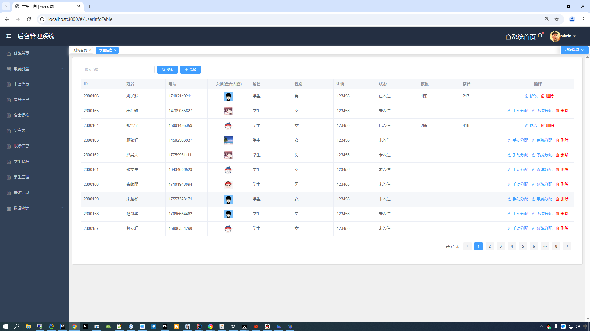
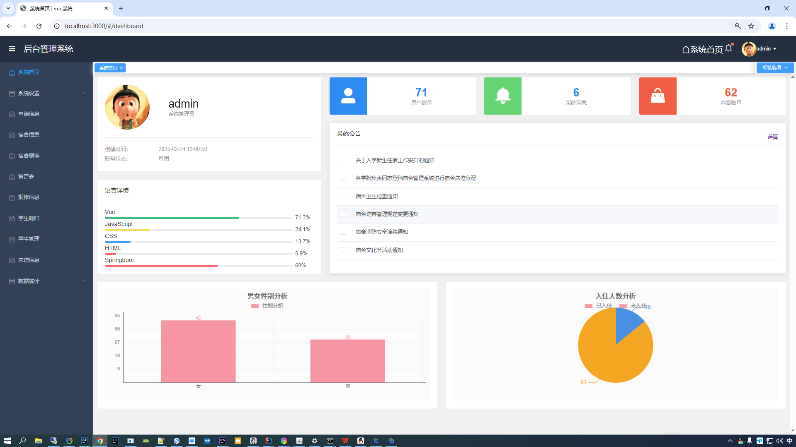
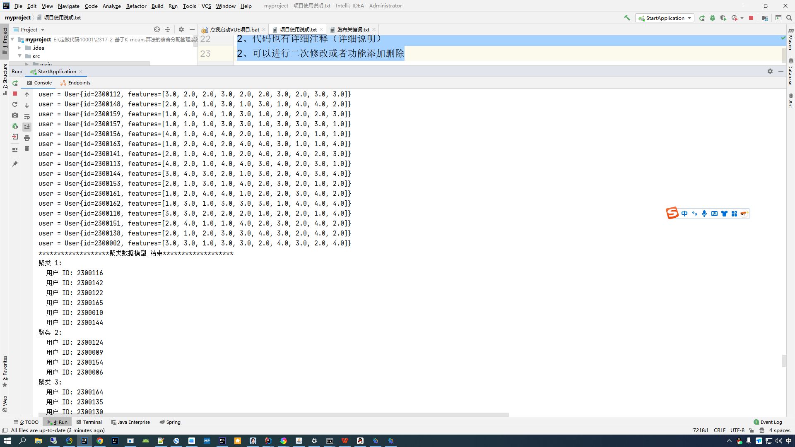

# dormitory_allocation_management_system
基于K-means算法的宿舍分类管理系统，三种角色：宿管+管理员+学生，Springboot和vue前后端分类源码，提供源码+数据库+文档+讲解代码视频

# B站演示视频地址   https://www.bilibili.com/video/BV1SZ99Y3Egq/

基于Springboot和vue的宿舍分配管理系统 的设计与实现

获取代码编号：2317_v3

#代码目录截图

#学生端已经登录

#学生端未登录

#宿舍管理员

#算法分配

#管理员

#聚类算法演示

网址： http://localhost:3000/

获取代码联系技术人员扣扣 1516993194 或者 2551449109

【系统测试账号】三种角色

    管理员 admin 123456
    
    宿舍  manage01 123456
    
    用户   test 123456  【可以注册】
    
【技术栈】

    后端：Springboot + MybatisPlus + MySQL
    
    前端：vue + Element Plus UI框架
    
    开发工具： idea +  node  + MySQL
    
    算法：K-means算法/贪心算法
    
【如果不会运行，可以找我们远程帮助调试运行】

1、数据库每个表都有详细注释

2、代码也有详细注释（详细说明）

2、可以进行二次修改或者功能添加删除

支持代码定做，修改，文档撰写
定做和代码二次修改说明:
①和客户沟通确定需求
②付款定金一半,开始定做
③定做好联系客户看效果,效果满意,远程帮助客户调试运行好
④项目定做提供的服务:
  1.代码和测试数据
2.数据库说明文档
3.代码讲解视频
      4.免费调试部署运行(没有运行软件我们帮安装)
5.售后答疑，服务到答辩结束为止

获取源码请加扣扣 1516993194  或者  2551449109
